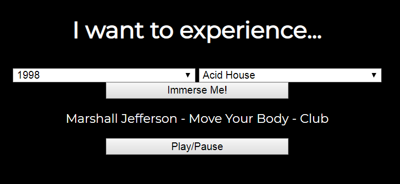

ABOUT
-----

This project is a web application where you can select a year and/or genre and a random song from that year will automatically play on your Sonos speaker!

It also utilizes [Spotify API](https://developer.spotify.com/documentation/web-api/) to search for songs.

USAGE
-----

This app utilizes [node-sonos-http-api](https://github.com/jishi/node-sonos-http-api) to control your sonos system on home wifi. To run my application, first get node-sonos-http-api working: 

`npm install --production` to fix dependencies, then

`npm start` to start the server.

Now you need a few configurations to make the web app to work on your computer: 

Enable cross-origin resource sharing. There are some [browser extentions](https://chrome.google.com/webstore/detail/allow-control-allow-origi/nlfbmbojpeacfghkpbjhddihlkkiljbi?hl=en) that will let you do this. 

Finally, open `index.html` in the `/static` folder.

Nice!

NOTES
-----

This is a prototype web application. 

In order for it to work, it is using my arbitrary Spotify app keys to make API calls. The Sonos speaker must also be named "Den." This can be configured on your sonos controller in setup. 